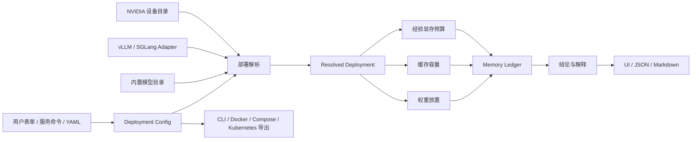

# LLM Memory Planner 方案设计

> 状态：逐节讨论中
>
> 最后更新：2026-07-11
>
> 需求基线：v1.9

## 1. 文档约定

本文档记录已确认的方案设计。每节标记确认状态；未确认内容不得作为实现依据。重大架构决策在整体方案确认后补充 ADR。

## 2. 顶层系统结构

> 状态：已确认（2026-07-11）

系统采用分层规划流水线，不为 vLLM、SGLang 分别复制计算器，也不把模型、命令、校准和 UI 全部依赖到一个巨型显存核心。

### 2.1 三个稳定契约

系统使用三个主要中间契约：

1. **Deployment Config**：记录用户想部署什么，不计算显存。
2. **Resolved Deployment**：记录固定框架版本解析后的实际 Deployment Group、node、device、rank、组件级并行和默认参数。
3. **Memory Ledger**：记录归属到物理设备和运行生命周期的显存项、上下界及证据。

模块通过契约协作，而不是互相读取内部状态。

### 2.2 部署解析职责

部署解析层负责：

- 应用 vLLM `v0.24.0`、SGLang `v0.5.15` 的版本化默认值；
- 校验模型、框架、NVIDIA 设备和并行拓扑兼容性；
- 自动生成 rank placement；
- 解析 PP layer、EP expert 和 SGLang DP Attention 的组件级放置；
- 将 PD 解析成独立的 Prefill、Decode 部署组；
- 对不支持组合返回明确的 `unsupported`。

它输出部署事实和诊断，不输出显存结论。

### 2.3 部署组术语

**部署组（Deployment Group）**是一组承担相同推理角色的同构机器、GPU 和服务进程。部署组是部署配置概念，不是 KV pool 或框架 memory pool。

每个部署组独立包含：

- `role`：`serving`、`prefill` 或 `decode`；
- runtime：框架、固定版本、镜像和框架参数；
- hardware：机器数、每机 GPU 数、GPU 型号和实际可用显存；
- topology：TP/PP/DP/EP/CP、SGLang DP Attention 等并行配置；
- workload：与角色相关的 max tokens、并发、batched/prefill tokens 和 chunk size。

普通部署包含一个 `serving` 部署组，同一组进程承担 Prefill 和 Decode。PD 部署包含一个 `prefill` 部署组和一个 `decode` 部署组；两个组分别加载模型、占用显存和接受容量判定，组间通过 connector 关联。

后续文档和 UI 使用完整名称“部署组”。`KV pool`、`memory pool` 和 `cache pool` 只用于表示框架内部显存分配对象。

### 2.4 模型归属

> 状态：已确认（2026-07-12）

模型和 checkpoint 是整份 Deployment Config 的顶层公共配置。普通部署和 PD 部署中的所有部署组必须引用同一个内置模型、固定 revision、checkpoint 和量化格式，部署组不能单独选择模型或 checkpoint。

PD 的 Prefill、Decode 部署组允许使用不同的框架参数、NVIDIA GPU、机器数量、并行拓扑和角色负载，但模型身份与 checkpoint 完全一致。这样可以保证两组对 tensor、cache layout 基础语义和 connector 数据含义使用同一个模型来源，也避免在部署组中重复模型元数据。

导入服务配置时，如果 Prefill、Decode 配置解析出不同模型、revision、checkpoint 或量化格式，应报告冲突并阻止显存计算和可执行导出，不自动选择任一侧。

### 2.5 框架归属

> 状态：已确认（2026-07-12）

推理框架和框架版本也是整份 Deployment Config 的顶层公共配置。普通部署和 PD 部署中的所有部署组必须使用同一个框架及同一个固定版本；MVP 为 vLLM `v0.24.0` 或 SGLang `v0.5.15`。

部署组只保存与角色、硬件和拓扑相关的框架参数覆盖，例如 Prefill 的 batched/prefill tokens、chunked prefill，Decode 的运行请求数、Graph capture size 和缓存配置。公共框架默认值由一个版本化 framework adapter 解析，避免 P/D 两组各自重复或产生不一致默认值。

MVP 不支持 vLLM Prefill + SGLang Decode 或反向组合。导入时如果 P/D 配置的框架或版本不同，应报告冲突并阻止显存计算与可执行导出，不尝试跨框架转换 KV layout 或 connector 语义。

### 2.6 三类显存分析器

- **权重放置**：根据内置 checkpoint tensor metadata、模型 placement strategy 和 Resolved Deployment 生成每 rank、每设备的常驻权重项。
- **缓存容量**：根据 cache strategy、框架 layout、block/page 规则和目标负载生成 KV、latent、indexer、state cache 项及 token 容量。
- **经验预算**：为加载/repack、CUDA Graph、activation、runtime、allocator、NCCL 和 PD connector 提供版本化保守上下界或实测覆盖。

三类分析器输出统一显存项，但互不修改彼此的计算结果。

### 2.7 账本与结论

Memory Ledger 将 rank/process 显存项聚合到物理设备，按生命周期和共存关系计算设备上下界，并定位最坏设备和瓶颈。

结论层基于同一账本独立输出：

- 权重可放置；
- 目标服务配置可启动；
- 保证和可能 max-token 容量；
- OOM 瓶颈及调整方向。

UI、JSON、Markdown 和命令导出不得重新实现显存公式。

### 2.8 采用理由与开源参考

- 参考 InferPlan 的纯 TypeScript 领域引擎和配置/结果分离方式。
- 参考 llm-cal 的 provenance、confidence 和兼容性分层。
- 参考 KVCache.ai 的 cache strategies 和公式测试向量。
- 自研 Resolved Deployment、组件级并行、设备账本和保守结论，因为现有项目不能同时覆盖多机、最坏设备、SGLang DP Attention、PD 分池和版本化经验边界。

## 3. 待讨论设计

1. Deployment Config；
2. Resolved Deployment 与版本化框架 adapter；
3. 内置模型和 tensor metadata；
4. 权重放置；
5. 缓存容量；
6. 经验预算、校准与 trace；
7. Memory Ledger 和判定；
8. 服务配置导入导出；
9. PD；
10. 前端信息架构；
11. 测试与验收；
12. 主站集成。
