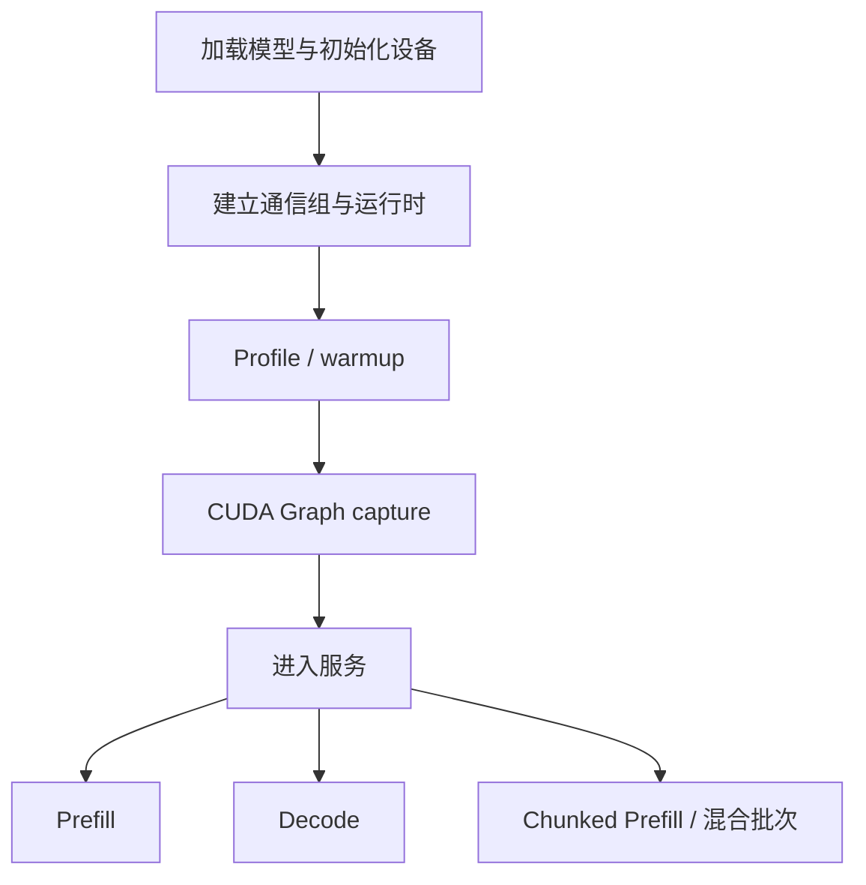
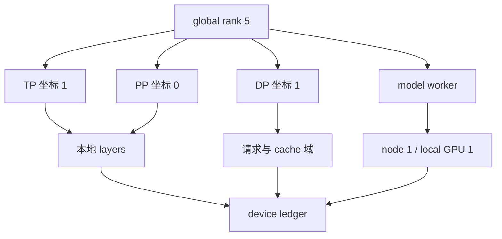
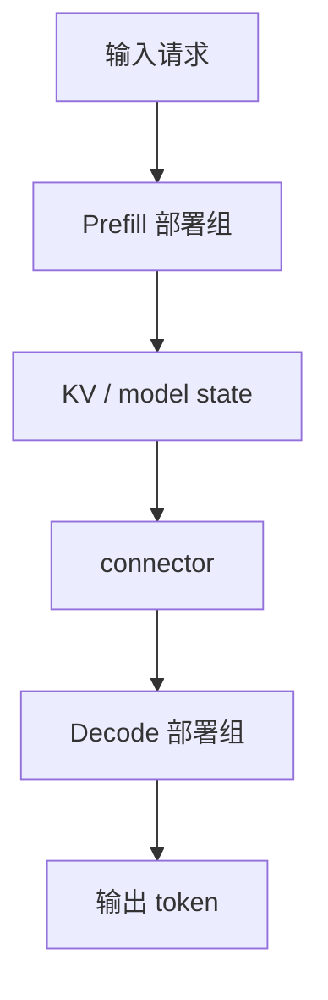
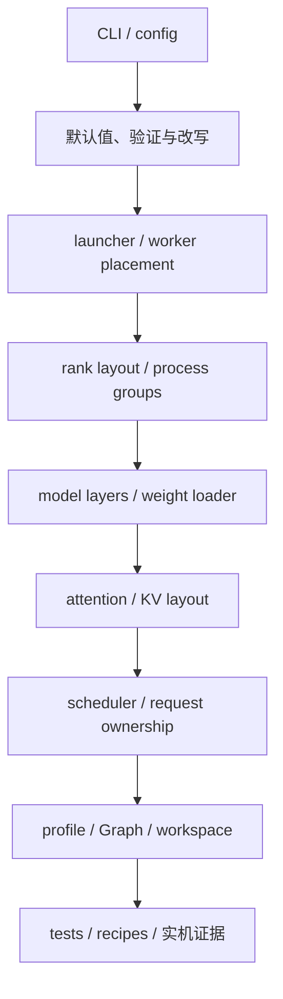

# 大模型推理并行策略与源码阅读基础

> 这是一份入门文档，面向第一次阅读 vLLM、SGLang 推理源码的工程师。

本文先讲通用概念，再说明怎样从源码确认事实。它不替代框架审计，也不承诺某个参数在所有模型、后端和版本上都可用。

阅读时始终抓住一个问题：一张物理设备在某个运行阶段，究竟有哪些 allocation 同时存活？显存规划器最终回答的也是这个问题。

## 1. 阅读地图：一次推理服务怎样使用显存

先从服务生命周期看起。服务启动后并不是一直处于同一种状态，不同阶段会出现不同的显存峰值。



### 1.1 加载与初始化

框架创建进程、绑定设备、初始化通信库，然后加载 checkpoint。此时最明显的是权重，但还有 CUDA context、通信 buffer、量化元数据和模型初始化临时张量。

“权重能装下”只说明第一关通过。服务还没有为 KV cache、CUDA Graph 和请求执行留下空间。

### 1.2 Profile、warmup 与 Graph capture

不少框架会先跑 dummy batch，测量非 KV 显存，再决定 KV pool 可以分到多少。启用 CUDA Graph 时，还会捕获一组 batch shape 或 token shape。

捕获过程可能同时存在旧 allocation、待固化的 graph pool 和捕获临时张量，所以启动期也会 OOM。捕获结束后，一部分内存池和静态 buffer 通常继续常驻，不能把 Graph 全部看成已经消失的临时项。

具体保留哪些 allocation，由框架版本、runner、backend 和 capture 配置决定。

### 1.3 Prefill

Prefill 读取 prompt，并为需要缓存的层建立初始 KV、latent 或其他模型状态。一次
forward 可能处理很多 token，activation 和 attention workspace 往往比 Decode 大。

长 prompt 不一定一次跑完。开启 chunked prefill 后，框架把它拆成多个 chunk，
降低单次 forward 的活跃 token 数。请求完成全部 Prefill 后，完整 prompt 对应的
缓存或状态仍要保留，所以 chunking 主要改变执行峰值，不会自动缩短最终上下文。

### 1.4 Decode

Decode 每步通常只为每个请求生成一个或少量 token，但要读取此前积累的 KV、
latent cache 或模型状态。并发请求越多、历史越长，相关缓存和状态占用通常越大。

Decode 常使用 CUDA Graph replay。此时不能把“Graph 显存”和“同一批 replay activation 的理论峰值”机械相加，因为 activation 可能已经放在 graph private pool 或静态 buffer 中。是否需要另加，要看测量口径。

### 1.5 混合批次

真实 scheduler 可能把 Decode 请求和一段 chunked prefill 放进同一 iteration。这个阶段既不是纯 Prefill，也不是纯 Decode，显存共存关系取决于 scheduler 和 runner。

因此，`phase` 在规划器里应理解为一种有明确共存关系的运行状态，而不是固定的三个标签。MVP 可以先支持初始化/捕获、Prefill、Decode 和已确认的混合路径，未建模的路径要标为未知。

## 2. 从物理设备理解 process、worker、rank 与 group

分布式术语容易让人误以为每个并行坐标都有一份显存。实际结算必须回到物理设备。

### 2.1 Device、process 和 worker

| 术语 | 常见含义 | 阅读源码时要确认什么 |
| --- | --- | --- |
| device | GPU、XPU 等物理设备 | 哪些进程在这张设备上创建 context 和 allocation |
| process | 操作系统进程 | 是否绑定单设备，是否只负责控制 |
| worker | 执行模型计算的逻辑单元 | 它是进程、actor，还是进程内对象 |
| engine | 调度和执行服务单元 | 是否拥有独立 scheduler 和 KV pool |
| controller | 路由或控制组件 | 是否加载模型，是否占用设备显存 |

常见 CUDA serving 是一张 GPU 对应一个模型 worker，但这只是常见情况。一个设备上可能有多个进程；控制进程也可能创建 CUDA context。规划器的数据结构不应把 `worker_id` 直接当作 `device_id`。

物理设备账本可以写成：

```text
device ledger
  device identity
  + processes bound to this device
  + workers owned by each process
  + resident allocations of those processes
  + phase-specific allocations that coexist
```

如果两个进程共享同一张卡，它们的 context、权重和运行时保留都要聚合到同一个 device ledger。最终拿这个结果与该卡实际可用显存比较。

### 2.2 Rank 是编号，不是一张额外的卡

`rank` 是进程在某个通信域中的编号。

- `global rank` 是 distributed world 中的编号，通常在 `[0, world_size)` 内。
- `local rank` 是当前机器上的编号，常用于选择本机设备。
- `group rank` 是某个 process group 内的编号。
- `tp_rank`、`pp_rank`、`dp_rank` 是并行维度上的坐标。

同一个 worker 可以同时具有这些身份：

```text
global_rank = 5
local_rank  = 1
tp_rank     = 1
pp_rank     = 0
dp_rank     = 1
```

它们描述的是同一个执行实体。下面的算法没有意义：

```text
一张卡显存 = TP rank 显存 + PP rank 显存 + DP rank 显存
```

正确做法是让这些坐标共同决定 rank 5 持有哪些模型组件、服务哪些请求，再把 allocation 记到 rank 5 所绑定的物理设备。

### 2.3 World 与 process group

`world` 是一组完成分布式初始化的进程，`world_size` 是进程数量。不同框架对 world 的边界处理不同：普通 DP 可能形成多个独立 world，也可能进入一个更大的 world。

Process group 是 world 中的一组 ranks。一个框架通常会建立 TP、PP、DP、EP 或 CP group。同一 rank 可以属于多个 group，这不会增加 worker 数。



### 2.4 Collective 是分片后的协作方式

权重、activation 或 token 被分开后，ranks 需要交换结果。

| 操作 | 直观含义 | 推理中的常见位置 |
| --- | --- | --- |
| all-reduce | 求和后让每个 rank 都得到结果 | Row Parallel 输出 |
| all-gather | 收集各 rank 的 slice | 拼接 hidden 或 token slice |
| reduce-scatter | 规约后每个 rank 只保留一段 | 分片输出 |
| all-to-all | 每个 rank 向其他 rank 发送不同内容 | MoE token dispatch |
| send/recv | 两个 rank 定向传输 | PP stage 边界 |

Collective 可能需要通信 buffer 或 workspace。权重缩小了，不代表临时显存按同样比例缩小。

## 3. TP、PP、DP、EP、CP 分别改变什么

这些缩写描述放置和协作方式。理解它们时，先问“切了哪个维度”，再问“是否复用已有 workers”。

### 3.1 Tensor Parallel：切同一层的张量

对矩阵乘法 `Y = XW`，Column Parallel 通常沿输出维切 `W`：

```text
W = [W0 | W1]

Y0 = XW0
Y1 = XW1
```

每个 rank 持有一部分输出列。局部结果可以继续保持分片，也可以 all-gather。

Row Parallel 沿输入维切 `W`，输入也分片：

```text
W = [W0]
    [W1]

X = [X0 | X1]
Y = X0W0 + X1W1
```

局部 partial output 通常需要 all-reduce。于是权重主体会缩小，输出 tensor 和通信 buffer 却未必缩小。

QKV 还要考虑 GQA/MQA。假设模型有 32 个 query heads、8 个 KV heads：

| 有效 attention TP | 每 rank query heads | 常见的每 rank KV heads | 结果 |
| ---: | ---: | ---: | --- |
| 2 | 16 | 4 | Q/K/V 都能继续切 |
| 8 | 4 | 1 | 每 rank 一个 KV head |
| 16 | 2 | 至少 1 | KV heads 开始在 ranks 间复制 |

当 TP 超过 KV head 数，K/V projection 与每 token KV payload 可能不再等比例下降。真实边界还受 divisibility、padding 和模型自定义 attention 影响。

所以不能直接用 `checkpoint bytes / TP` 作为每卡权重。norm、bias、量化 scale 可能复制，embedding 和 `lm_head` 可能按 vocabulary 分片，K/V 还会遇到复制饱和。

### 3.2 Pipeline Parallel：按层分 stage

PP 把模型层放到不同 stage，请求沿 stage 依次执行：

```text
stage 0: embedding + 前半层
  -> stage 1: 后半层 + final norm + lm_head
```

每个 stage 只保存本地 attention layers 的 KV。首尾 stage 还可能多出 embedding 或输出头，层数也未必能被 PP 整除。每卡权重不能用 checkpoint 平均除以 PP。

PP 的结论取决于最坏 stage。平均值刚好装下没有用，只要一个 stage 超出物理显存，服务就起不来。

stage 之间还要发送 activation。send/recv buffer 是否复用、是否 double buffer、混合批次是否重叠，都可能改变运行峰值。

### 3.3 普通 DP：复制完整服务副本

普通 Data Parallel 常见语义是把完整模型执行域复制多份，再把请求路由到某一份：

```text
router
  -> replica 0: TP/PP workers + scheduler + KV pool
  -> replica 1: TP/PP workers + scheduler + KV pool
```

每个 replica 内部仍可使用 TP 和 PP。增加普通 DP 通常会增加总吞吐容量，却不会降低单副本每卡权重，也不会把单请求 KV 分摊到两个副本。

如果两个副本各能保存 100k cached tokens，服务聚合容量接近 200k，不代表一个请求可以拥有 200k context。单请求受其所在 cache 容量域约束。

### 3.4 组件级 DP：只让模型的一部分按 DP 工作

有些实现中的 `DP` 不表示复制整条 forward。典型情况是 attention 与 MoE 使用不同的通信域，或者 scheduler 把请求分区后，某些组件仍在更大的 rank group 上协作。

这类策略应逐组件描述：

```text
attention:
  在哪个 group 内分片或复制？

MoE experts:
  在哪些 ranks 上放置？

scheduler / KV:
  请求在哪个分区内竞争容量？
```

SGLang 的 DP Attention、vLLM 的部分 MoE 数据并行语义，都不能套用“DP 等于完整副本”这一句话。名称相同，权重和 KV 的归属可能不同。

### 3.5 Expert Parallel：分布 routed experts

MoE block 不只有 experts。它还可能包含 attention、router、shared experts、shared expert gate 和量化辅助 tensor。

EP 主要处理 routed expert 的放置与 token dispatch。例如 8 个 experts 分到 4 个 EP ranks，最简单的布局是每 rank 两个 experts。实现中还可能有：

- expert padding 或冗余副本；
- 单个 expert 内继续做 TP；
- shared experts 复制，或使用另一套 TP group；
- all-to-all 的 send/receive 与 permutation buffer。

EP group 常建立在已有 TP/DP ranks 上。看到 `EP=4` 不能直接把设备数再乘 4，应从 group construction 找出它复用了哪些 global ranks。

### 3.6 CP 与 DCP：切 token 或 context 工作

Context Parallel 沿 sequence、token 或 context 维协作。它不是跨框架统一的实现名称。

阅读 CP 时需要确认：

- 它作用于 Prefill、Decode，还是两者；
- 分的是 query、KV token、block，还是 attention 中间状态；
- 它创建新 workers，还是在已有 TP ranks 上建 subgroup；
- KV 是分 token、分 head，还是发生复制；
- 哪个 attention backend 真正接入了这条路径。

DCP 通常专注 Decode context，常见实现会复用 TP workers。此时 worker 数和 checkpoint 权重可能不变，变化的是 Decode 的 token ownership、attention 工作和通信。

`DCP=2` 不能作为除数直接作用于总权重或总显存。

## 4. 显存账本：先算 raw peak，再判断安全余量

显存账本要区分 allocation 的生命周期。一个实用的分类是：

| 类别 | 例子 | 常见生命周期 |
| --- | --- | --- |
| 模型常驻项 | 权重、量化 metadata | 模型加载后长期存在 |
| cache 常驻项 | 预分配 KV pool、状态缓存 | 服务期长期存在 |
| Graph 常驻项 | private pool、静态输入输出 buffer | capture 后在适用 runner 中保留 |
| runtime 常驻项 | CUDA context、通信 buffer、allocator reserve | 进程或服务期存在 |
| 阶段临时项 | eager activation、capture scratch、MoE workspace | 某次 phase 内存在 |
| 自定义项 | connector staging、模型特有 state | 由实际生命周期决定 |

### 4.1 Raw peak 是实际共存 allocation 的峰值

对物理设备 `d` 和阶段 `p`：

```text
raw_peak(d, p)
  = resident_bytes_alive_in_phase(d, p)
  + peak_transient_bytes(d, p)
```

如果一个设备上绑定多个进程，`resident_bytes` 和 `transient_bytes` 都要按进程聚合。同一块共享或复用内存只能记一次。

设备最终峰值是：

```text
raw_peak(d) = max(raw_peak(d, p) for each supported phase p)
```

这里的 phase 不是把曾经见过的所有最大值相加。Capture 临时 workspace 不会自动和稳态 Prefill activation 共存；若 scheduler 有 Prefill/Decode 混合路径，则应另建 mixed phase。

### 4.2 安全余量不是 allocation

安全余量用于判定，不应加进 raw peak。假设设备可用显存为 `available`，配置的余量比例为 `r`：

```text
operational_ceiling = available x (1 - r)
```

然后分别比较：

```text
raw_peak > available
  -> 物理 OOM

operational_ceiling < raw_peak <= available
  -> 未 OOM，但没有满足安全余量

raw_peak <= operational_ceiling
  -> 满足该安全余量条件
```

这只是容量判断。若 activation、Graph 或 runtime 尚无适用预算，结论仍需保留不确定性，不能因为算式小于上限就声称一定能运行。

### 4.3 Graph 要拆成常驻和捕获临时项

CUDA Graph 不是一个单一比例。至少要区分：

```text
graph resident
  capture 后继续存在的 private pool、static buffers 等

capture transient
  只在捕获过程中出现的 activation、scratch 或临时副本

replay transient outside graph pool
  replay 时仍在 graph pool 之外分配的工作区
```

Graph capture 阶段的峰值可能写成：

```text
capture raw peak
  = weights
  + KV pool already allocated at capture time
  + runtime resident
  + graph resident allocated so far
  + capture transient
```

稳态 Decode 若走 replay，需要把 replay activation 分成两部分。Graph pool 已覆盖的
allocation 只计在 Graph resident 中，不能再加一份同 shape 的 activation 估算；
pool 之外的 workspace 才进入 Decode transient。Prefill 走 eager、Decode 走
Graph 时，二者也应分开建账。

框架报告的 `graph memory` 可能是捕获前后 free memory 的差，也可能是估算值。使用前要查清 runner 路径和测量口径。

### 4.4 Activation、workspace 与 allocator

Activation 受当前 forward token 数、hidden size、模型结构、backend 与并行布局影响。Chunked prefill 改变的是每次 forward 的 token 数，不是最终 KV 长度。

Workspace 包括 attention scratch、GEMM workspace、MoE permutation、collective buffer、PP 边界 buffer 和 connector staging。它们常由具体实现决定，仅靠 checkpoint 无法精确推导。

Allocator reserve、fragmentation 和 CUDA context 也属于实际设备占用，但不要和安全余量混为一谈：前者是 allocation 或保留量，后者是人为留下的容量门槛。

## 5. KV cache：pool 显存与请求占用是两本账

多数 serving 框架会在启动时创建固定大小的 KV pool。此后 Prefill 和 Decode 从 pool 中申请 blocks，pool 的 resident bytes 通常不会随每个 token 再增长一遍。

### 5.1 先算本地每个 stored token 的 payload

标准 attention 的教学公式是：

```text
bytes_per_stored_token_local
  = sum over local attention layers (
      local_K_elements_per_token
      + local_V_elements_per_token
    )
    x cache_dtype_bytes
```

这里的 `local` 已经包含 PP 层归属、KV head 分片或复制，以及模型特有 cache layout。不要在公式末尾再次无条件除以 TP、PP、CP 或 DCP。

接着确定本 rank 实际拥有多少 token slots：

```text
owned_slots
  = num_local_blocks x block_size

kv_pool_resident_bytes
  = bytes_per_stored_token_local
  x owned_slots
  + cache_alignment_or_metadata_if_applicable
```

CP/DCP 可能改变 `bytes_per_stored_token_local`，也可能改变 `owned_slots`，取决于它分 head 还是分 token。必须从 cache layout 选择其中正确的 ownership 维度，不能重复除法。

### 5.2 Block rounding 决定请求占用容量

假设 block size 是 16 tokens，一个没有 prefix 共享的请求当前需要保存 17 tokens：

```text
occupied_blocks = ceil(17 / 16) = 2
occupied_slots  = 2 x 16 = 32
```

请求在 pool 中占用 32 个 token slots，其中 15 个暂时没有承载有效 token。这个 rounding 用于判断 workload 是否超过 pool capacity，不是要在 KV pool resident bytes 之外再加一份请求 KV 显存。

多个请求的简化容量检查为：

```text
required_blocks
  = sum(ceil(stored_tokens_for_request_i / block_size))

required_blocks <= allocatable_blocks_in_this_capacity_domain
```

真实实现还可能有 prefix block 共享、speculative slots、cache group 分别取整、
滑窗回收或 block metadata。Metadata 也要先确认存放位置：host 侧索引不计入
设备显存，device tensor 则进入对应 device ledger。这些规则应由 cache adapter
提供。

### 5.3 Prefill 和 Decode 增长的是占用，不是第二个 pool

Prefill 把 prompt KV 写入已分配的 blocks；Decode 随生成继续占用更多 blocks。若 pool 已预分配，设备 resident bytes 基本固定，变化的是：

- free blocks 数量；
- 每个请求占用的 block 映射；
- 是否因容量不足而无法调度或触发抢占；
- 少量随请求增长的 metadata。

只有框架采用按需物理分配，或者会扩缩 pool 时，token 增长才会改变 resident allocation。这个事实要由目标版本源码确认。

### 5.4 容量域决定空闲 KV 能不能互相借用

容量域是一组请求可以共同竞争 blocks 的边界。它可能对应一个 scheduler、一个 DP replica 或某个 attention 分区。

两个独立 pools 各有 40 GiB：

- 服务聚合 KV 是 80 GiB；
- 路由到 pool 0 的请求只能使用 pool 0 的 blocks；
- pool 1 的空闲空间不会自动借给 pool 0；
- prefix cache 的共享通常也受这个边界限制。

因此至少要分别输出服务聚合容量、每个容量域的容量，以及单请求在目标域内可达到的最大 context。

`max model length`、`max batched tokens`、chunk size 和并发数也不是同一个输入：

| 概念 | 限制什么 |
| --- | --- |
| max model length | 单请求 input + output 的长度上限 |
| max batched tokens | 一次 scheduler iteration 处理的新 token 上限 |
| chunk size | 一次 prefill forward 的 token 上限 |
| max running requests | 同时参与运行的请求数量 |
| KV pool slots | 一个容量域能保存的历史 token 槽位 |

## 6. 算一遍：TP=2、PP=2、DP=2

下面用一个虚构模型说明推导过程。数字只用于教学，不代表 vLLM 或 SGLang 的真实占用。

### 6.1 先画 worker 拓扑

每个普通 DP replica 内有 `TP x PP = 4` 个 workers，`DP=2` 共 8 个。下表使用
部署级 worker 编号，便于把两份副本放在一起看：

| worker 编号 | DP | PP | TP | 物理设备 |
| ---: | ---: | ---: | ---: | --- |
| 0 | 0 | 0 | 0 | GPU 0 |
| 1 | 0 | 0 | 1 | GPU 1 |
| 2 | 0 | 1 | 0 | GPU 2 |
| 3 | 0 | 1 | 1 | GPU 3 |
| 4 | 1 | 0 | 0 | GPU 4 |
| 5 | 1 | 0 | 1 | GPU 5 |
| 6 | 1 | 1 | 0 | GPU 6 |
| 7 | 1 | 1 | 1 | GPU 7 |

以 worker 5 为例：`PP=0` 决定它持有 embedding 和前半层，`TP=1` 决定这些 tensor
的本地 slice，`DP=1` 表示它属于第二个请求与 cache 域。三个坐标最后只生成
GPU 5 的一份账本。

真实的 global rank 要由 launcher 决定。两个普通 DP replicas 可能各自拥有
`global rank 0..3`，也可能处于同一个八进程 world；不能从 `TP x PP x DP` 这三个
配置值直接认定 rank 编号。无论采用哪种启动方式，设备账本的推导方法不变。

### 6.2 再按 stage 计算常驻项

假设 checkpoint placement 与实测预算得到：

| 常驻项 | PP stage 0 每卡 | PP stage 1 每卡 |
| --- | ---: | ---: |
| 本地权重 | 18.5 GiB | 17.0 GiB |
| KV pool resident | 20.0 GiB | 22.0 GiB |
| runtime resident | 1.5 GiB | 1.5 GiB |
| Graph resident | 3.0 GiB | 2.5 GiB |
| 稳态 resident 小计 | 43.0 GiB | 43.0 GiB |

stage 0 因 embedding 更大；stage 1 的本地 attention layers 或 cache layout 让
KV pool 更大。按 PP 平均分配总字节会漏掉这种不对称。

普通 DP 复制这套布局，所以部署级 worker 0 和 4 的组件相同，worker 1 和 5 相同。
DP 没有让单卡数字再除以 2。

### 6.3 按 phase 加入实际共存的临时项

假设版本化校准给出：

| Phase | Stage 0 transient | Stage 0 raw peak | Stage 1 transient | Stage 1 raw peak |
| --- | ---: | ---: | ---: | ---: |
| Graph capture | 8.0 GiB | 51.0 GiB | 6.0 GiB | 49.0 GiB |
| Prefill eager | 7.0 GiB | 50.0 GiB | 5.0 GiB | 48.0 GiB |
| Decode replay | 1.0 GiB | 44.0 GiB | 1.5 GiB | 44.5 GiB |

表中的 Decode transient 只包括 Graph pool 之外的 allocation，replay working memory 已计入 Graph resident，因而没有重复相加。

最坏设备位于 stage 0，最坏阶段是 Graph capture，raw peak 为 51 GiB。两个 DP replicas 都会出现同样的最坏卡。

若每卡实际可用显存为 56 GiB，安全余量为 5%：

```text
operational_ceiling = 56 x 0.95 = 53.2 GiB

raw_peak = 51 GiB
```

这个示例满足安全余量条件。若 Graph transient 没有目标版本和设备的依据，最终
状态仍应标明该项待校准。

### 6.4 上下文容量另算

假设每个 DP replica 有一个独立 KV 容量域。两个 replica 的 aggregate capacity 可以相加，用于描述整个服务能承载多少请求；单请求最大 context 不能跨 replica 相加。

对目标 workload，应在每个容量域内做 block rounding：

```text
sum(ceil(request_stored_tokens / block_size))
  <= blocks available in that replica
```

这一步回答“权重加载后支持多大上下文”，与前面的 device raw peak 相关但不是同一道算式。

## 7. PD 分离与源码阅读路线

在本项目中，PD 分离把同一个 fixed checkpoint 的 Prefill 和 Decode 放入两个部署
组。两组使用同一框架及固定版本，可以采用不同的硬件、机器数量和并行拓扑；每个
部署组内部的机器和设备规格保持一致。P/D 各自建立设备账本与 cache 容量域。



### 7.1 P/D 要分别展示

Prefill 侧和 Decode 侧各有自己的：

- 权重副本与 workers；
- scheduler、KV pool 和容量域；
- Graph、activation、runtime reserve；
- 最坏设备与最坏阶段。

不能把 P/D 的显存相加成一张卡的需求，也不能把两侧 KV pool 相加成单请求最大 context。

Connector 的网络传输字节不等于额外常驻显存。需要检查 send/receive staging、
layout 转换和 gather/scatter，也要确认传输窗口内的状态归属。Prefill sender 可能
在确认完成前继续保留源 blocks，Decode receiver 可能提前预留目标 blocks。两侧
各自按本地生命周期计峰值；sender retention 与 receiver reservation 同时存在，
表示跨部署组的资源重叠，不是把两组显存合成一张卡。

### 7.2 源码应按数据流阅读

仅搜索 `tensor_parallel_size` 或 `dp_size`，只能发现入口。可靠的阅读顺序是：



参数解析先记录原始值，再找 resolved configuration。框架可能自动改 backend、
限制 Graph shape，或者根据模型类型关闭某种并行策略。显存计算使用解析后的事实，
同时保留原始参数供解释和命令往返。

Launcher 决定总 worker 数、每机进程数、local rank 到 device 的映射，以及
controller 是否占卡。由此可以判断 `DP`、`EP`、`CP` 是否增加物理 workers。

Process group construction 给出各并行 group 的真实成员。最好用一个小拓扑手工
列出 global ranks 和 group 成员，避免读错多维 reshape 的轴顺序。

模型构造和 weight loader 要按组件检查：Q/K/V/O、dense FFN、routed/shared experts、embedding、输出头、norm 与量化 metadata。通用 ParallelLinear 的规则可能被模型文件或量化路径覆盖。

KV 需要同时读 attention backend、cache manager 和 scheduler。前者给出本地 payload，cache manager 给出 blocks 与 layout，scheduler 决定请求在哪个容量域中占用它们。

Profile、warmup、Graph capture 和运行时 buffer 决定经验项的范围。无法从
checkpoint 推导的部分，需要版本化预算或实测。

### 7.3 参数存在不等于组合受支持

能力证据至少有几层：源码中有字段，validation 允许该组合，模型真正接入实现，目标 backend 有测试，目标硬件实际跑通。

例如某 attention backend 默认声明不支持一种 CP 路径，即使 CLI 接受 `--cp-size`，也不能据此对该模型给出显存结论。工具遇到这种组合应返回 `unsupported` 或证据不足，而不是套一个理论除数。

框架能力必须绑定具体版本、模型、checkpoint、backend、量化方式和 topology。

## 8. 术语速查与后续文档

| 术语 | 本文含义 |
| --- | --- |
| device ledger | 汇总一张物理设备上所有相关进程和阶段 allocation 的账本 |
| worker | 执行模型计算的逻辑单元 |
| rank | worker/process 在 world、group 或并行维度中的编号 |
| world | 参与一次分布式初始化的 ranks |
| process group | 为某种通信建立的 rank 子集 |
| TP | 沿 tensor、head 或 hidden 维切同一层 |
| PP | 沿模型层切成 pipeline stages |
| 普通 DP | 复制完整模型执行域并分配请求 |
| 组件级 DP | 只有部分模型组件或请求域使用 DP 语义 |
| EP | 放置 routed experts，并在 ranks 间路由 token |
| CP | 沿 token、sequence 或 context 维协作的策略总称 |
| DCP | 面向 Decode context 的并行路径，具体语义依实现 |
| capacity domain | 一组请求共同竞争 cache blocks 的边界 |
| KV pool resident | 已向设备分配并常驻的 KV pool 字节数 |
| occupied blocks | 请求当前从 KV pool 占用的 blocks |
| raw peak | 某阶段真实共存 allocation 的峰值，不含人为安全余量 |
| safety margin | 从可用容量中预留的判定空间，不是 allocation |
| Graph resident | Capture 后继续保留的 Graph pool 或静态 buffer |
| capture transient | 仅在 Graph capture 期间存在的临时 allocation |
| Prefill | 处理 prompt 并建立初始 KV |
| Decode | 读取历史 KV 并生成后续 token |
| chunked prefill | 将长 prompt 拆成多次 Prefill forward |
| PD | 将 Prefill 与 Decode 放到两个部署组 |

接下来可阅读版本化审计：

- [vLLM v0.25.0 并行策略源码审计](./2026-07-13-vllm-v0.25.0-parallelism-source-audit.md)
- [SGLang v0.5.15 并行策略源码审计](./2026-07-12-sglang-v0.5.15-parallelism-source-audit.md)
- [vLLM 与 SGLang 并行策略异同](./2026-07-12-vllm-sglang-parallelism-comparison.md)

框架审计中的结论以 exact tag 源码为准。
