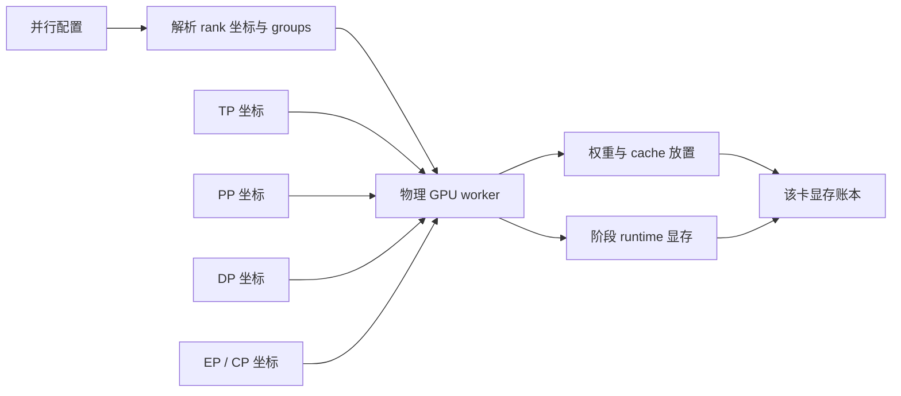
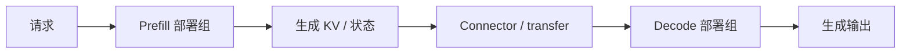
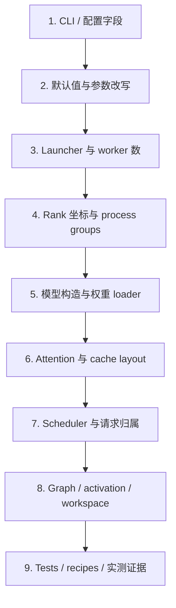

# 大模型推理并行策略与源码阅读基础

> 面向第一次阅读 vLLM、SGLang 等推理框架源码的工程师，建立从物理 GPU、并行坐标到显存归属的基础心智模型

本文不绑定某个框架版本，也不定义 LLM Memory Planner 的最终数据结构。文中的简化公式用于解释概念；实际模型是否支持某种并行方式、具体如何分片，仍应以目标版本的模型实现、运行时实现和测试证据为准。

## 1. 先明确我们到底在研究什么

大模型推理并行策略要回答的不只是“用了几张卡”，而是以下四类问题：

1. **执行拓扑**：启动了多少进程，每个进程绑定哪张设备，进程之间建立了哪些通信组。
2. **模型放置**：每张卡持有哪些权重，包括 attention、FFN、expert、embedding 和输出头。
3. **请求与缓存归属**：一个请求由哪个 scheduler 管理，KV cache 分配在哪个缓存分区和哪些物理卡上。
4. **运行时峰值**：Prefill、Decode、CUDA Graph capture 等阶段，权重之外还有哪些 activation、通信和临时 workspace 同时存在。

对于显存规划器，最终结算对象必须回到**物理设备上的 worker**：

```text
某张物理 GPU 的阶段峰值显存
  = 该 worker 实际持有的权重
  + 该 worker 实际管理的 KV/状态缓存
  + 当前阶段 activation
  + CUDA Graph 和捕获内存池
  + collective / kernel / connector workspace
  + runtime、allocator 和安全余量
```

TP、PP、DP、EP、CP 是描述上述归属关系的坐标或策略，不是五块可以直接相加的显存。

## 2. 从单卡 Transformer 显存开始

理解分布式之前，先看一张卡上通常有哪些显存项。

```mermaid
flowchart TB
    accTitle: 单卡推理显存组成
    accDescr: 一张 GPU 上的推理显存由常驻权重和缓存、阶段相关临时项以及运行时保留组成

    total["单卡峰值显存"]
    persistent["常驻项"]
    phase["阶段相关项"]
    runtime["运行时项"]
    weight["模型权重"]
    cache["KV / 状态缓存"]
    activation["Activation"]
    graph["CUDA Graph"]
    workspace["Kernel / 通信 workspace"]
    allocator["Allocator / context / reserve"]

    total --> persistent
    total --> phase
    total --> runtime
    persistent --> weight
    persistent --> cache
    phase --> activation
    phase --> graph
    phase --> workspace
    runtime --> allocator
```

### 2.1 权重

权重不仅是 Transformer block 中的几个大矩阵，还可能包括：

- token embedding 和 `lm_head`；
- attention 的 Q、K、V、O projection；
- dense FFN 的 up、gate、down projection；
- MoE router、routed experts 和 shared experts；
- normalization、bias；
- 量化 scale、zero point、codebook、padding 和打包元数据；
- speculative decoding 或 MTP 的附加层。

Checkpoint 总字节数是重要输入，但不能直接当成每卡权重。分布式运行时会让不同 tensor 采用不同的分片或复制规则。

### 2.2 KV cache 和其他状态缓存

自回归生成需要保存历史 token 的中间状态。标准 attention 通常保存每层的 K 和 V；其他模型还可能使用 latent cache、indexer cache、卷积状态或状态空间模型的 state cache。

以标准 KV 为教学近似，一份 token 的逻辑 payload 可写为：

```text
KV bytes/token
  = 本地 KV 层数
  x 本地 KV head 数
  x head dimension
  x 2                    # K 和 V
  x cache dtype bytes
```

“本地”二字很关键。PP 会改变本卡持有的层数，TP/CP/DCP 可能改变本卡持有的 KV head 或 token slice。page/block 对齐还会令实际分配量高于逻辑 payload。

### 2.3 Activation 和临时张量

Activation 是一次 forward 中产生的中间结果，通常受以下因素共同影响：

- 当前 forward 的 token 数；
- hidden size、intermediate size、head 数；
- attention backend 和 kernel 融合方式；
- TP、CP 等策略下当前 rank 实际处理的 token 或 hidden slice；
- 是否执行 chunked prefill；
- 是否捕获或回放 CUDA Graph。

因此，“权重能加载”不代表“服务能启动”。加载权重后剩余显存还要容纳 KV pool、Graph、activation 和 runtime workspace。

## 3. 分布式运行的基础词汇

### 3.1 Process、worker 与 device

这些词在不同框架中并不总是严格同义，阅读源码时要看它们实际指向什么：

| 术语 | 常见含义 | 阅读时要确认 |
| --- | --- | --- |
| process | 操作系统进程 | 是否一进程绑定一设备，还是一个控制进程管理多个 worker |
| worker | 执行模型计算的逻辑单元 | 是进程、线程、远程 actor，还是进程内对象 |
| device | GPU/XPU 等物理设备 | 一个 worker 是否独占设备，是否存在多进程共享 |
| engine | 调度和执行服务单元 | 是否拥有独立 scheduler、KV pool 和请求队列 |
| controller | 路由或控制进程 | 是否加载模型，是否占用加速卡显存 |

在常见 GPU serving 路径中，可以暂时使用“一张 GPU 对应一个模型 worker”的心智模型，但源码审计必须验证这个假设。

### 3.2 Rank、global rank 与 local rank

`rank` 是一个进程在某个通信域中的编号。

- `global rank`：在整个 distributed world 中的编号，通常范围为 `[0, world_size)`。
- `local rank`：进程在当前机器上的本地编号，常用于选择 `CUDA_VISIBLE_DEVICES` 中的某张卡。
- `group rank`：进程在某个 process group 内的编号。
- `tp_rank`、`pp_rank` 等：进程在特定并行维度上的坐标。

同一个进程可以同时是：

```text
global_rank = 5
local_rank  = 1
tp_rank     = 1
pp_rank     = 0
dp_rank     = 1
```

这些编号从不同角度描述同一个 worker，并不代表五个进程。

### 3.3 World 与 world size

`world` 是一组参加分布式通信的进程，`world_size` 是其中的进程数。

要特别小心：配置中的 `TP x PP x DP` 不一定等于某段源码里的 `world_size`。某些实现把 DP 副本做成多个互相独立的 world；另一些实现把 DP 也放进一个更大的 world。只能从 launcher 和 distributed initialization 的源码确认。

### 3.4 Process group

Process group 是 global world 中的一组 rank，用于完成某一种协作。例如，一个 8-rank world 可以同时建立：

- 若干个 TP group；
- 若干个 PP group；
- 一个或多个 DP group；
- EP、CP 或 DCP group。

同一 rank 可以同时属于多个 group。group 是通信关系的“视图”，不是额外 GPU。

### 3.5 同一物理 rank 有多个并行坐标

假设一个简化部署使用：

```text
TP = 2
PP = 2
DP = 2
物理 worker 数 = 2 x 2 x 2 = 8
```

一种可能的坐标映射如下：

| global rank | DP 坐标 | PP 坐标 | TP 坐标 | 物理实体 |
| ---: | ---: | ---: | ---: | --- |
| 0 | 0 | 0 | 0 | GPU worker 0 |
| 1 | 0 | 0 | 1 | GPU worker 1 |
| 2 | 0 | 1 | 0 | GPU worker 2 |
| 3 | 0 | 1 | 1 | GPU worker 3 |
| 4 | 1 | 0 | 0 | GPU worker 4 |
| 5 | 1 | 0 | 1 | GPU worker 5 |
| 6 | 1 | 1 | 0 | GPU worker 6 |
| 7 | 1 | 1 | 1 | GPU worker 7 |

以 `global rank 5` 为例，它是：

- DP 副本 1 的成员；
- PP stage 0 的成员；
- TP slice 1 的成员；
- 一张确定的物理 GPU 上的一个 worker。

在这份教学布局中，它还可以同时属于：

```text
TP group = [4, 5]       # 同一 DP 副本、同一 PP stage 内协同执行一层
PP group = [5, 7]       # 同一 DP 副本、同一 TP slice 跨 stage 传递 activation
DP group = [1, 5]       # 两个副本中相同 PP/TP 坐标的位置
```

这三个 group 都包含 rank 5，却没有为它创造三张 GPU。假设模型的 stage 0 包含 embedding 和前半层，那么 rank 5 的放置推导是：

```text
PP 坐标 0
  -> 只加载 stage 0 的 embedding 和前半层

TP 坐标 1
  -> 对上述组件加载 slice 1；norm 等不可分组件仍可能完整复制

DP 坐标 1
  -> 这些组件属于副本 1；请求和 KV 使用副本 1 的容量域

最终
  -> 全部结果都落到 global rank 5 对应的同一张物理 GPU 的显存账本
```

具体 group 成员和层分配只是为了展示推导方法；实际轴顺序由目标框架的 rank layout 决定。

正确结算方式是：找出 rank 5 实际持有的 PP stage 0 层、这些层的 TP slice、该 DP 副本的 KV 分区，以及它的运行时项，然后得到 rank 5 的显存。

错误方式是：

```text
rank 5 显存 = TP rank 显存 + PP rank 显存 + DP rank 显存
```

TP/PP/DP rank 不是三个显存容器，它们只是 rank 5 的三个坐标。



## 4. Collective：并行计算如何拼回完整结果

权重或 token 分到多张卡后，各 rank 需要通过 collective 通信交换数据。常见操作包括：

| Collective | 直观含义 | 常见用途 | 可能的显存影响 |
| --- | --- | --- | --- |
| all-reduce | 各 rank 的值求和，并把结果发回所有 rank | Row Parallel partial output 汇总 | 通信 buffer、结果 tensor |
| all-gather | 收集所有 rank 的 slice，每个 rank 得到完整结果 | hidden/token slice 拼接 | 完整 gather buffer |
| reduce-scatter | 先规约，再让每个 rank 只保留一段 | 聚合后直接分片 | shard 输出和通信 workspace |
| all-to-all | 每个 rank 向其他 rank 发送不同数据 | MoE token dispatch | send/receive buffer、padding |
| broadcast | 一个 rank 向组内其他 rank 发送数据 | 参数或 metadata 同步 | 接收 buffer |
| point-to-point | rank 间定向发送/接收 | PP stage 之间传 activation | stage boundary buffer |

Collective 的重要性有两层：

1. 它说明“分片”并不等于没有代价，结果可能需要重新收集。
2. 通信库和 fused kernel 可能申请持久或临时 workspace，这部分通常不能仅从 checkpoint 公式得到。

源码阅读不能只看模型权重 loader，还要追到 forward 中调用了何种 collective、输入 shape 多大、buffer 是否缓存复用。

## 5. Tensor Parallel：按张量维度切权重

Tensor Parallel（TP）让多个 rank 协同执行同一层。最经典的解释来自矩阵乘法：

```text
Y = XW
```

### 5.1 Column Parallel Linear

将权重 `W` 沿输出维切开：

```text
W = [W0 | W1]

Y0 = XW0
Y1 = XW1
Y  = [Y0 | Y1]
```

每个 rank 持有一部分输出列，输入 `X` 通常是完整的。局部输出也只有一部分；后续层可以继续消费这个分片，或者通过 all-gather 得到完整输出。

显存含义：

- 大矩阵权重通常近似按 TP 减少；
- bias 若沿输出维对应切分，也会分片；
- 是否立即 gather 决定 activation 和通信峰值。

### 5.2 Row Parallel Linear

将权重 `W` 沿输入维切开，同时将输入切开：

```text
W = [W0]
    [W1]

X = [X0 | X1]

Y = X0W0 + X1W1
```

每个 rank 先产生局部 partial output，之后通常通过 all-reduce 得到完整 `Y`。

显存含义：

- 权重主体可按输入维分片；
- 输出可能在每个 rank 上保持完整；
- bias、partial output 和 collective buffer 不一定按 TP 缩小。

### 5.3 QKV Parallel 与 GQA/MQA 复制

Attention 的 Q、K、V 不能简单看成三个同样切分的矩阵。模型可能是：

- MHA：query head 数和 KV head 数相同；
- GQA：多个 query head 共享较少的 KV heads；
- MQA：所有 query heads 共享极少量 KV head。

假设一个 GQA 模型有 `32` 个 query heads、`8` 个 KV heads：

| 有效 attention TP | 每 rank query heads | 每 rank KV heads | KV 是否复制 |
| ---: | ---: | ---: | --- |
| 2 | 16 | 4 | 否 |
| 4 | 8 | 2 | 否 |
| 8 | 4 | 1 | 否 |
| 16 | 2 | 至少 1 | 是，KV head 开始跨 rank 复制 |

当有效 TP 宽度超过 KV head 数，每个 rank 仍需要至少一个可用 KV head。此后继续增大 TP：

- Q projection 可能继续缩小；
- K/V projection 不再按 TP 等比例缩小；
- 每 token 的本地 KV cache 也可能停止下降。

表格只表达常见布局。真实实现还受 head divisibility、padding、模型自定义 attention 和有效 attention group 影响，必须检查具体 QKV layer 构造和 loader。

### 5.4 为什么“总权重 / TP”不成立

即使只讨论 dense 模型，每个组件也可能不同：

| 组件 | 常见放置方式 |
| --- | --- |
| attention Q | 按 query heads 或输出维分片 |
| attention K/V | 按 KV heads 分片，达到 head 数后复制 |
| attention O | 常见为 Row Parallel |
| FFN up/gate | 常见为 Column Parallel |
| FFN down | 常见为 Row Parallel |
| norm | 常见为复制 |
| embedding/lm_head | 常见为 vocabulary parallel，也可能复制或共享 |
| quant scales | 可能分片，也可能按量化 group 复制或 padding |

因此正确方法是按 tensor 或组件的 placement rule 结算，而不是对 checkpoint 总量做一次除法。

## 6. Pipeline Parallel：按层切分模型

Pipeline Parallel（PP）把连续或规则分配的层放到不同 stage。请求依次经过各 stage：

```text
tokens
  -> stage 0: embedding + layers 0..N
  -> stage 1: layers N+1..M
  -> stage 2: layers M+1..K + final norm + lm_head
  -> logits
```

### 6.1 PP 不是 checkpoint 字节平均除法

不同 stage 的权重通常不完全相同：

- 首 stage 可能额外持有 embedding；
- 末 stage 可能额外持有 final norm 和 `lm_head`；
- 层数不能整除 PP 时，各 stage 的层数不同；
- 某些模型存在跨层共享、MTP、视觉 encoder 或特殊 block；
- tied embedding 和 lm_head 的实际存储方式依实现而定。

每个 stage 的 KV cache 也只对应其本地 attention layers。于是同样的 KV block 数，在 layer 更多的 stage 上需要更多字节。

### 6.2 最坏 stage 决定能否运行

假设两个 PP stage 的单卡账本如下：

| 项目 | Stage 0 | Stage 1 |
| --- | ---: | ---: |
| 权重 | 35 GiB | 31 GiB |
| 目标 KV | 30 GiB | 30 GiB |
| Graph/runtime | 10 GiB | 8 GiB |
| 合计 | 75 GiB | 69 GiB |

如果单卡实际可用显存是 `72 GiB`，部署仍会因为 stage 0 OOM。不能使用两个 stage 的平均值 `72 GiB` 得出“刚好能运行”。

此外，一个请求需要穿过完整 pipeline。若框架要求各 stage 使用一致的逻辑 cache block 数，最紧张 stage 可能限制整个 pipeline 的 token 容量。

### 6.3 PP 边界也有运行时显存

stage 之间要发送 activation。需要确认：

- send/receive buffer 是临时还是常驻；
- 是否 double buffer；
- microbatch 或并发调度如何重叠；
- Prefill 和 Decode 的 boundary shape 是否不同。

这些信息通常位于 pipeline runner、scheduler 和 communication implementation 中，而不在模型权重定义中。

## 7. Data Parallel：复制服务副本并分配请求

普通 Data Parallel（DP）的直观语义是复制完整模型服务：

```text
请求路由器
  +-> DP replica 0: 自己的权重、scheduler、KV cache
  +-> DP replica 1: 自己的权重、scheduler、KV cache
```

如果每个副本内部使用 `TP=4, PP=2`，那么一个副本可能需要 8 个模型 worker。`DP=2` 则复制两套这样的执行域。

### 7.1 DP 通常不会降低单请求显存

增加普通 DP 的主要作用是增加服务副本和总体容量，而不是降低每卡权重：

- 每个副本仍需持有完整模型，只是模型内部可继续使用 TP/PP；
- 请求通常只被路由到一个 DP 副本；
- 该请求的 KV 只占用目标副本的 cache；
- 单请求最大上下文受单副本容量限制，不能把两个副本的空闲 KV 相加。

例如两个副本各自最多容纳 `100k` aggregate cached tokens：

- 服务总体可能容纳约 `200k` tokens 的请求集合；
- 单个请求不能因此拥有 `200k` context；
- 一个副本满载、另一个空闲时，是否可迁移请求取决于框架能力，不能默认成立。

### 7.2 Scheduler 是显存语义的一部分

DP 不只是权重复制。请求由谁管理，会决定 KV 的容量域：

- 一个 scheduler 对应一个 KV pool，还是多个 scheduler 共用 pool；
- router 按请求数、token 数还是显式 key 选择副本；
- prefix cache 是否只在副本内部复用；
- `max_num_seqs`、`max_running_requests` 是全服务限制还是每分区限制。

这些问题必须阅读 controller、engine、scheduler 和 cache manager，不能从 `--dp-size` 字面推断。

## 8. MoE 与 Expert Parallel

Mixture of Experts（MoE）层包含 router 和多个 experts。每个 token 通常只进入其中少数 experts，但模型仍需在集群中放置全部 expert 权重。

### 8.1 先拆开 MoE 的组件

一个 MoE block 可能包含：

- attention；
- router/gate；
- routed experts；
- shared experts；
- shared expert gate；
- dense fallback 或其他辅助模块。

Expert Parallel（EP）主要描述 routed experts 如何分布，不等于整个 block 都除以 EP。

### 8.2 EP 的两类工作

1. **放置 expert 权重**：不同 EP rank 持有不同 expert 子集，或者继续切分单个 expert 矩阵。
2. **路由 token**：根据 router 结果，将 token 通过 all-to-all 等方式发送到持有目标 expert 的 rank，再把结果送回。

假设有 8 个 experts、`EP=4`，最简单的教学布局是每个 EP rank 持有 2 个 experts。但真实实现还可能包括：

- expert 数不能整除时的 padding；
- 冗余 experts；
- 一个 expert 内继续做 tensor parallel；
- shared experts 在所有 rank 复制或采用另一套 TP；
- expert load balancing 和运行时迁移；
- quantized expert 的 scale/metadata 放置。

### 8.3 EP 不一定增加物理 GPU 数

很多实现是在已有的一组物理 ranks 上建立 EP group，重新解释这些 rank 的 expert 权重归属。因此不能看到 `EP=8` 就再把 worker 数乘以 8。

正确问题是：

```text
EP group 由哪些 global ranks 组成？
这些 ranks 是否已经是 TP/DP ranks？
每个 rank 最终持有哪些 experts 和 expert tensor slices？
```

### 8.4 MoE 的运行时峰值

MoE 显存不只有 expert 权重。运行时还可能包括：

- router logits 和 top-k index；
- token permutation 和 unpermutation buffer；
- all-to-all send/receive buffer；
- capacity padding；
- fused MoE kernel workspace；
- expert 负载统计；
- 重分配或迁移期间的临时双份权重。

这些项与 token 分布、backend 和 kernel 实现相关，通常需要版本化预算或实测边界。

## 9. Context Parallel 与 Decode Context Parallel

Context Parallel（CP）试图沿 token 或 sequence/context 维度分工，而不是沿模型 hidden 维或 layer 维分工。

### 9.1 CP 的基本动机

长上下文 Prefill 的 activation 和 attention 计算很大。如果将一段 sequence 分给多个 rank，各 rank 可以只处理部分 query/token slice，再通过通信获得 attention 所需的信息。

但“CP”不是跨框架统一的一种实现。需要逐项确认：

- 它作用于 Prefill、Decode，还是两者；
- 它切 query、K/V、token block 还是 attention state；
- 是否增加新的 worker；
- 是否复用已有 TP ranks；
- 需要 all-gather、all-to-all、ring attention 还是 LSE 合并；
- KV cache 是分 token、分 head，还是复制；
- 哪些 attention backend 支持。

### 9.2 DCP 的常见语义

Decode Context Parallel（DCP）通常专注 Decode 阶段，把历史 KV/context 工作分给多个 rank。常见实现会复用现有 TP ranks，而不是创建额外 GPU。

例如 TP group 有 4 个 ranks，`DCP=2` 可能在 TP group 内形成两个或若干 DCP subgroup。此时：

- worker 数仍由原 TP/PP 等拓扑决定；
- checkpoint 权重未必改变；
- Decode 的 KV token slice、attention work 和通信发生变化；
- 每卡 KV 是否真正下降，取决于 cache layout 和 backend；
- Graph 和 workspace 也可能变化。

因此，不能把 DCP 当成额外除数直接应用于总权重或总显存。

### 9.3 不要把所有 CP 压成一个数字

下面这些配置即使名字都含 `context parallel`，也可能完全不同：

| 语义 | 可能作用阶段 | 是否增加 worker | 主要影响 |
| --- | --- | --- | --- |
| Prefill context split | Prefill | 依实现而定 | 长 prompt activation、attention 通信 |
| Decode context split | Decode | 常复用现有 rank | 历史 KV 处理、decode attention |
| Attention 内部 CP | Prefill 或 Decode | 常复用某个 world | 有效 attention TP、KV/head/token ownership |

阅读配置字段只是起点，必须追到 group construction、attention forward 和 cache layout。

## 10. Scheduler、cache partition 与容量域

显存规划不能只知道“全服务共有多少 KV cache”，还要知道 cache 分成了哪些独立容量域。

> **容量域**：一组请求可以共同竞争和复用的缓存资源边界。它可能对应一个 engine、一个 scheduler、一个 DP 副本，或一个 attention 请求分区。

### 10.1 为什么容量域重要

假设服务有两个彼此独立的 KV pools，各有 `40 GiB`：

- 服务聚合 KV 是 `80 GiB`；
- 但一个被路由到 pool 0 的请求最多只能使用 pool 0 可提供的空间；
- pool 0 OOM 时，pool 1 的空闲空间不会自动变成 pool 0 的空间；
- prefix cache 命中通常也只在拥有相应 block 的域内成立。

所以至少要分别理解：

- 全服务 aggregate capacity；
- 每个 scheduler/cache partition capacity；
- 单请求在一个容量域内可达到的最大 context。

### 10.2 请求路由必须和 cache ownership 一起读

源码阅读可以按以下链路追踪：

```text
HTTP / RPC request
  -> router/controller 选择 endpoint
  -> endpoint 对应 scheduler
  -> scheduler 选择 worker group
  -> cache manager 分配 blocks/pages
  -> attention layer 读取本地 cache slice
```

只看最后的 KV tensor shape，可能会遗漏前面已经把请求拆到不同容量域这一事实。

## 11. KV page/block：逻辑 token 不等于实际分配字节

推理框架通常不为每个请求连续分配一整块最大长度 KV，而是把 cache 预先组织为固定大小的 page 或 block。

### 11.1 逻辑 payload 与物理分配

假设：

```text
block size = 16 tokens
本地 KV payload = 128 KiB/token
一个请求实际需要 17 tokens
```

那么它至少占用 2 blocks，也就是 32-token capacity。逻辑 payload 只有 `17 x 128 KiB = 2.125 MiB`，但它会在框架预分配的 KV pool 中消耗 `32 x 128 KiB = 4 MiB` 容量。最后 15 个 token 槽暂时未使用，但对应 block capacity 已被这个请求占用。

这里要区分两层账：KV pool 的 resident bytes 通常在服务启动时一次性计入设备显存；请求长度只决定从该 pool 中占用多少 blocks。显存规划器不能再把每个请求的 `4 MiB` 作为额外物理分配与整个 pool 重复相加，而应使用它判断目标 workload 需要的 block 数是否超过 pool capacity。

常见关系是：

```text
requested blocks  = ceil(required tokens / block_size)
occupied capacity = requested blocks x bytes_per_block
```

实际实现还可能包含：

- block metadata；
- request-to-token 映射表；
- hash、reference count 和 free list；
- prefix cache 的共享引用；
- alignment 和 allocator rounding；
- hybrid attention 中多种 cache group。

### 11.2 为什么“差一个 block”是合理误差边界

理论公式能准确得到 payload，但请求长度映射到 page 后会发生离散化。比较估算和实测时，应先确认差值是否来自：

- page/block 向上取整；
- 每层或每 cache group 分别取整；
- worker 间统一采用最小 block 数；
- cache pool 预分配时的 alignment。

如果不统一 page 语义，仅比较小数 GiB 很容易得出错误结论。

## 12. Prefill、Decode 与 Chunked Prefill

### 12.1 Prefill

Prefill 一次处理 prompt 中的多个 token，为每层生成初始 KV。其特点通常是：

- 单次 forward token 数大；
- activation 峰值高；
- attention kernel 处理长 sequence；
- 新增大量 KV；
- 可能需要和已有 running Decode 请求共存。

### 12.2 Decode

Decode 通常每个请求每步生成一个或少量 token，但会同时处理多个 running requests：

- 单步新 token 少；
- 要读取较长历史 KV；
- batch size 可能较大；
- 常使用 CUDA Graph 降低 launch overhead；
- KV pool 会随生成持续增长。

### 12.3 Chunked Prefill

Chunked Prefill 把一个长 prompt 拆成多个 chunk，而不是一次全部 forward。例如 `32k` prompt 可以按 `8k` token 的 chunk 分四次处理。

它主要改变：

- 单次 Prefill 的最大活跃 token 数；
- activation 和部分 workspace 峰值；
- Prefill 与 Decode 混合调度时的同时存在关系；
- 某些 Graph capture shape。

它通常不会减少该请求最终需要保存的总 KV：四个 chunk 完成后，仍要保留完整 `32k` prompt 对应的 KV。

### 12.4 `max model length`、batch token 和 chunk size 不是同一输入

| 参数概念 | 回答的问题 |
| --- | --- |
| max context / model length | 单请求 input + output 最多允许多少 token |
| max batched tokens | 一次 scheduler iteration 最多处理多少新 token |
| chunked prefill size | 一个 Prefill chunk 最多处理多少 token |
| max running requests/sequences | 同时处于运行状态的请求数 |
| KV pool tokens | cache 容量域中可以保存多少历史 token |

它们共同影响显存，但不能互相替代。

## 13. CUDA Graph、activation 与 workspace

### 13.1 CUDA Graph 为什么占显存

CUDA Graph 会记录一组固定 shape 的 GPU 操作，以便后续快速 replay。为了保证 replay 时地址稳定，框架可能为捕获 shape 保留：

- 静态输入/输出 buffer；
- activation memory pool；
- kernel workspace；
- 每种 batch size 或 token shape 的 graph executable 相关资源。

Graph 显存通常与下列组合有关：

```text
框架版本
+ 模型实现
+ attention / MoE backend
+ capture shapes
+ 最大 capture batch/token 数
+ 并行 topology
+ dtype / quantization
```

因此它不是一个跨框架固定比例，也不应仅按参数量估算。

### 13.2 Capture、Prefill、Decode 是不同显存阶段

服务启动可能经历：

1. 初始化和加载权重；
2. profile/dummy run；
3. CUDA Graph capture；
4. 稳态 Prefill；
5. 稳态 Decode；
6. 混合批次或特殊 runtime 路径。

不同阶段的显存项并非全部同时存在。正确峰值算法是分别计算同阶段共存项，再取最大值：

```text
peak(worker)
  = max(
      init_or_capture_peak,
      prefill_peak,
      decode_peak,
      other_supported_phase_peak
    )
```

把所有阶段见过的最大临时项无条件相加会过度保守；只看稳态 Decode 又可能漏掉启动时 Graph capture OOM。

### 13.3 Workspace 是实现相关项

典型 workspace 包括：

- attention kernel scratch；
- GEMM tuning/workspace；
- MoE permutation 和 all-to-all buffer；
- collective library buffer；
- CP/DCP 中间结果或 LSE；
- PP send/receive buffer；
- allocator fragmentation 和 memory pool reserve。

这部分正是需要源码、版本化经验预算和实测校准的原因。校准不是为了把理论值“修饰得更准”，而是给无法仅靠模型结构确定的实现项建立可用边界。

## 14. PD 分离中的显存归属

Prefill-Decode disaggregation（PD 分离）把 Prefill 和 Decode 放到两个部署组：



### 14.1 P/D 是两套独立显存账本

两个部署组通常各自具有：

- 硬件和 worker topology；
- 权重副本；
- scheduler 和请求生命周期；
- cache pool；
- Graph、activation 和 runtime reserve。

Prefill 侧与 Decode 侧可以使用不同并行拓扑，因此应分别找最坏卡和容量，不能把 P/D 显存相加成“一张卡的需求”，也不能把二者 KV 容量相加成单请求 context。

### 14.2 传输字节不等于额外常驻显存

已有 KV 从 Prefill 传到 Decode，不代表 Prefill 一定额外复制一整份 KV。需要检查 connector：

- 是否直接注册现有 cache buffer；
- 是否分配 send/receive staging buffer；
- 是否因两侧 TP/head layout 不同而 gather/scatter；
- metadata、队列和 inflight requests 占多少空间；
- Decode 是否在传输完成前预分配目标 KV blocks。

只有实际存在的 staging 和转换 buffer 才应作为额外显存项，不能把“网络传输量”直接当成“GPU 常驻量”。

## 15. 如何从源码确认一种并行策略

参数名只能说明用户可以表达什么，不能证明运行时最终做了什么。建议按下面的顺序逐层阅读：



### 15.1 第 1 层：CLI 与配置字段

记录：

- 用户能设置哪些参数；
- 参数默认值和别名；
- help text 声称的作用；
- 配置对象之间如何传递。

此时只能得到“表面配置”，不能直接形成显存结论。

### 15.2 第 2 层：Resolved configuration

搜索参数验证和自动改写：

- 是否根据模型类型自动开启或关闭功能；
- 是否根据 TP/DP 等计算有效并行宽度；
- 是否改写 chunk size、Graph shapes、backend；
- 哪些组合会被拒绝；
- 环境变量是否覆盖 CLI。

显存计算应使用 resolved 事实，而不是只保存原始命令值；原始值仍应保留用于解释和往返导出。

### 15.3 第 3 层：Launcher 和 worker 数

确认：

- 总共启动多少模型 workers；
- 每台机器启动多少；
- controller/router 是否使用 GPU；
- DP 是多个独立 worlds 还是一个大 world；
- local rank 如何映射到设备；
- 多机 rank 如何排列。

这是判断“并行度是否增加物理卡”的唯一可靠入口之一。

### 15.4 第 4 层：Rank 坐标和 process groups

找到 distributed initialization 和 group construction，画出：

- global rank tensor 的 shape 和轴顺序；
- TP、PP、DP、EP、CP/DCP group 的成员；
- 哪些 group 复用同一批 ranks；
- 一个 worker 具有哪些派生坐标。

建议用一个小配置手工枚举 rank 表，避免被多维 reshape 误导。

### 15.5 第 5 层：模型构造和权重 loader

按组件检查：

1. embedding 和 `lm_head`；
2. Q/K/V/O；
3. dense FFN；
4. routed/shared experts；
5. norm、bias 和量化辅助 tensor；
6. MTP、draft 或模型特有模块。

不要只读通用 `ParallelLinear`。模型文件可能传入不同 group、覆盖 loader，或在特定量化路径上采用另一种 layout。

### 15.6 第 6 层：Attention 和 cache layout

确认：

- cache dtype；
- 本地 KV heads、layers 和 token slice；
- page/block size；
- cache groups 和 hybrid cache；
- PP stage 如何统一 block 数；
- CP/DCP 如何改变 ownership；
- prefix cache 的共享范围。

KV payload 公式应该从这些 resolved local dimensions 构造。

### 15.7 第 7 层：Scheduler 和请求归属

追踪一个请求：入口如何路由、由哪个 scheduler 接收、在哪个 cache partition 分配 block、由哪些 workers 执行。

这一层决定：

- 普通 DP 的副本边界；
- 服务 aggregate capacity 与单分区 capacity；
- 单请求 max context；
- P/D 传输前后的生命周期和额外预分配。

### 15.8 第 8 层：Graph、activation 与 runtime

搜索 profile、dummy run、capture、memory pool 和 reserve：

- capture 哪些 shapes；
- Prefill 与 Decode 是否分别捕获；
- activation 如何估计或实测；
- 哪些 backend 分配常驻 workspace；
- 初始化峰值是否高于服务稳态峰值。

这部分通常需要和目标设备实测对齐，不能仅靠静态模型元数据。

### 15.9 第 9 层：测试与能力证据

一个参数出现在 CLI、一段实现可以 import，均不等于目标组合可用。至少区分：

- 源码具有实现路径；
- 参数验证允许；
- 模型接入该路径；
- 目标 backend/量化/并行组合有测试；
- 目标硬件实际运行通过。

能力结论应绑定框架版本、模型、checkpoint、backend、量化和 topology，不能只写“支持 TP/EP/CP”。

## 16. 常见误解与纠正

| 常见误解 | 为什么错误 | 正确检查方式 |
| --- | --- | --- |
| 每卡权重等于 checkpoint / TP / PP | tensor 分片规则不同，PP stage 非对称 | 按 tensor placement 和 stage layers 求和 |
| TP、PP、DP、EP rank 显存要相加 | 它们可能是同一物理 worker 的坐标 | 先解析物理 worker，再结算其所有组件 |
| DP 增大后单请求 context 会增大 | 普通 DP 通常是独立 cache 容量域 | 检查请求是否能跨副本共享 KV |
| EP=8 就需要在 TP 之外再乘 8 张卡 | EP 常复用已有 ranks | 阅读 EP group 的实际成员 |
| DCP=2 就把总显存除以 2 | DCP 常只改变 Decode KV/context 分工 | 检查权重、KV layout 和 backend 分别如何变化 |
| chunked prefill 会降低最终 KV | 它主要降低一次 forward 的活跃 token 峰值 | 分开计算 activation 峰值和最终 cache payload |
| Graph 是固定百分比 | capture shapes 和 backend 会改变保留量 | 阅读 capture 列表并使用版本化实测预算 |
| 网络传了多少 KV 就额外占多少 GPU 显存 | connector 可能直接使用已有 cache buffer | 检查 staging、gather/scatter 和预分配 |
| CLI 有参数就表示模型支持 | 模型/backend 可能未接入或显式拒绝 | 检查模型实现、validation、tests 和实测 |

## 17. 阅读两份框架审计文档的建议路线

读完本文后，再按以下顺序阅读版本化源码审计，可以减少被相同参数名误导的风险。

### 17.1 第一遍：只建立执行拓扑

分别在 vLLM 和 SGLang 审计文档中寻找：

1. public parameters 和 resolved defaults；
2. worker/world 数量公式；
3. global rank 的坐标布局；
4. 实际建立的 process groups；
5. scheduler 和 cache partition 数量。

第一遍先回答“有多少张物理卡、多少个执行和容量域”，不要急着计算显存。

### 17.2 第二遍：逐组件画 placement 表

对每个物理 worker 关注：

- PP stage 持有哪些 layers；
- attention 使用哪个有效 TP/group；
- K/V 是否因 GQA/MQA 复制；
- dense FFN 如何分片；
- routed/shared experts 各自如何放置；
- embedding、head、norm、scale 是否复制。

此时才形成每卡权重事实。

### 17.3 第三遍：追请求和 KV

从 router/controller 追踪请求到 scheduler 和 cache：

- 普通 DP 与组件级 DP 的区别；
- 每个 cache partition 的 workers；
- PP、CP、DCP 如何改变本地 KV；
- page/block 和 prefix cache 的作用域；
- PD 模式 P/D 两侧分别如何分配和传输。

### 17.4 第四遍：补齐经验显存项

最后阅读：

- chunked prefill 和 batch token；
- CUDA Graph capture shapes；
- activation profile；
- collective/MoE/connector workspace；
- allocator 和 runtime reserve；
- 目标版本的测试和不支持组合。

最终应能把任意关键结论写成下面的证据链：

```text
用户参数
  -> resolved 配置
  -> worker 和 group
  -> 模型组件 / 请求 / cache 归属
  -> 物理 GPU 上的显存项
  -> 目标运行阶段的峰值
  -> 对应源码和测试证据
```

### 17.5 比较两个框架时的原则

应先分别完成上述四遍阅读，再阅读异同文档。比较时使用运行事实，而不是仅比较名字：

- 两边的 `DP` 是否都表示独立完整副本；
- 两边的 `EP` 是否使用相同 ranks、相同 expert placement；
- 两边的 `CP/DCP` 是否作用于同一阶段和 cache 维度；
- 同一个模型在两边是否使用相同 QKV、MoE 和量化 layout；
- scheduler/cache partition 是否具有相同边界。

相同缩写只表示研究入口，不代表可共享一套显存公式。

## 18. 阅读完成后的自检问题

在声称“已经理解某个框架的并行策略”之前，应能回答：

1. 给定配置会启动多少个模型 workers，如何分布到机器和设备？
2. 任意 global rank 的 TP、PP、DP、EP、CP/DCP 坐标是什么？
3. 每个 process group 的 rank 成员是谁，它用于哪种 collective？
4. 每个 PP stage 具体持有哪些 layers 和首尾组件？
5. Q/K/V、FFN、experts、embedding/head、norm/scale 分别如何分片或复制？
6. GQA/MQA 在有效 attention TP 变大时，KV head 何时开始复制？
7. 一个请求由哪个 scheduler 管理，占用哪个 cache partition？
8. 服务 aggregate max tokens、单分区 max tokens 和单请求 max context 分别受什么限制？
9. Prefill、Decode、Graph capture 的峰值中，哪些显存项同时存在？
10. 当前结论是通用实现事实、目标模型能力，还是仅有未验证代码路径？

如果其中任何问题只能靠参数名字猜测，就还没有完成源码级审计。

## 19. 术语速查

| 术语 | 本文中的简明含义 |
| --- | --- |
| worker | 执行模型计算并在设备上持有显存的逻辑单元 |
| rank | worker/process 在某通信域或并行维度中的编号 |
| world | 参与一组分布式初始化的全部 ranks |
| process group | world 的 rank 子集，用于特定 collective |
| TP | 沿 tensor/head/hidden 等维度切同一层 |
| PP | 沿模型层切成多个 pipeline stages |
| DP | 将请求分给模型副本或框架定义的数据并行域 |
| EP | 在 ranks 间放置 routed experts 并路由 token |
| CP | 沿 sequence/context/token 维进行协作的策略总称 |
| DCP | 面向 Decode context/KV 的并行策略，具体语义依实现 |
| scheduler | 决定请求何时运行、如何组成 batch 的组件 |
| cache partition | 一组请求可以分配 KV/cache 的资源边界 |
| page/block | cache 分配的固定粒度 |
| Prefill | 处理 prompt 并建立初始 KV 的阶段 |
| Decode | 读取历史 KV 并逐步生成新 token 的阶段 |
| chunked prefill | 将长 prompt 拆成多个较小 forward chunks |
| CUDA Graph | 捕获固定 shape GPU 工作以供后续 replay 的机制 |
| activation | forward 中间张量 |
| workspace | kernel、通信或转换操作使用的辅助显存 |
| PD | 将 Prefill 和 Decode 部署到不同部署组 |

本文提供的是阅读工具，而不是目标框架的最终结论。版本相关事实应以相应的 vLLM、SGLang exact-tag 源码审计文档为准。
